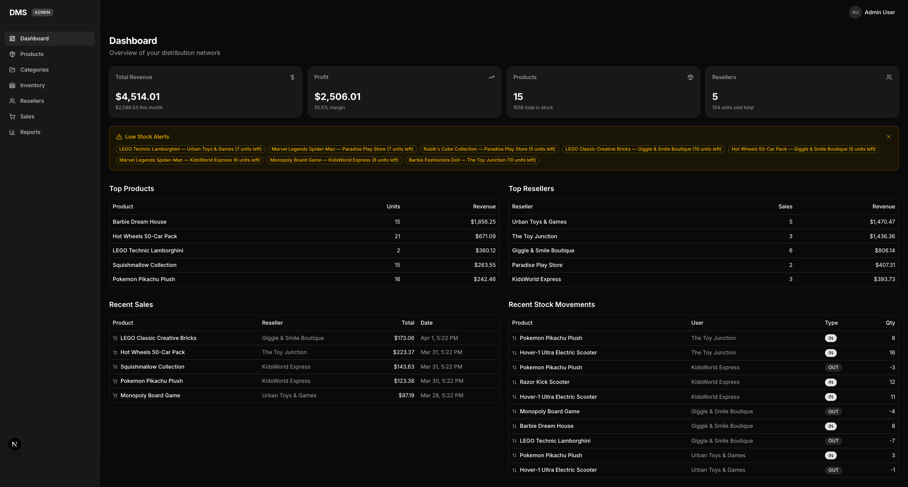
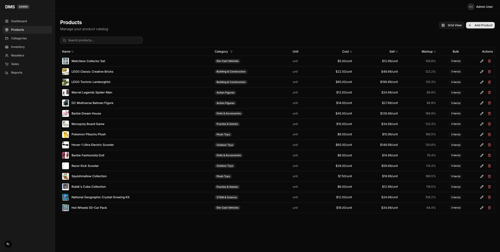
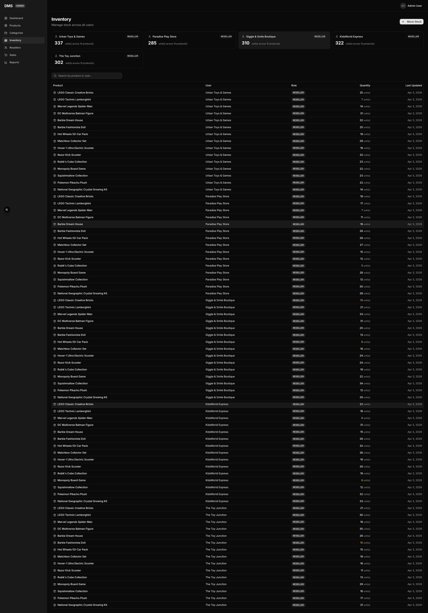
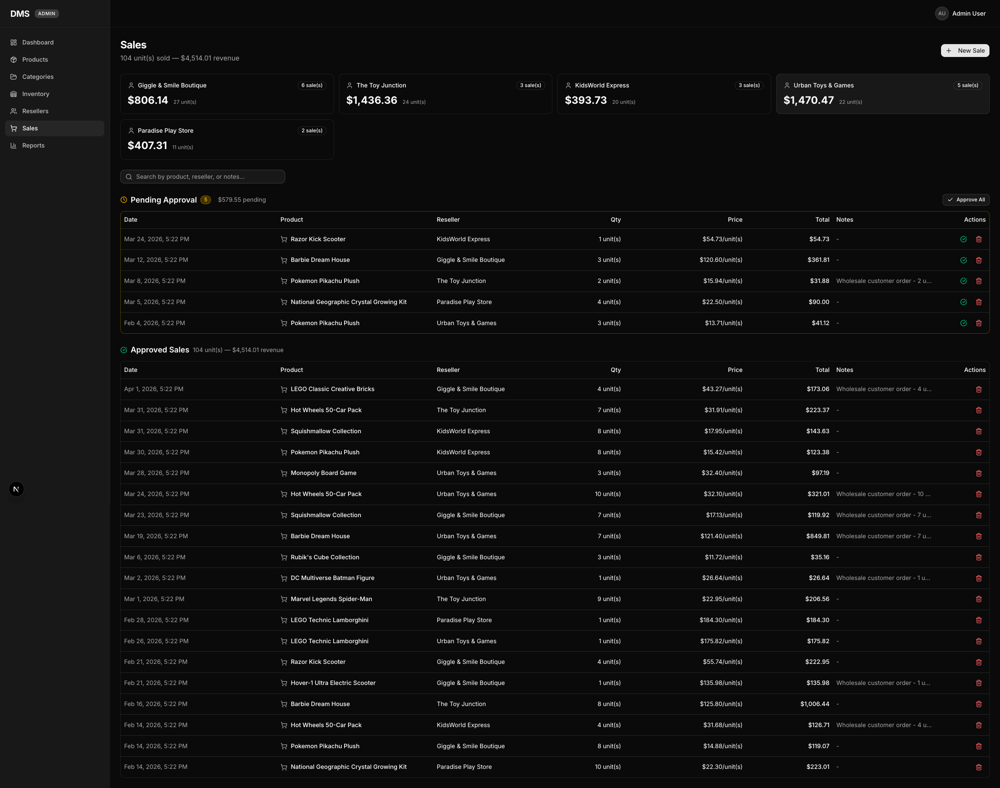
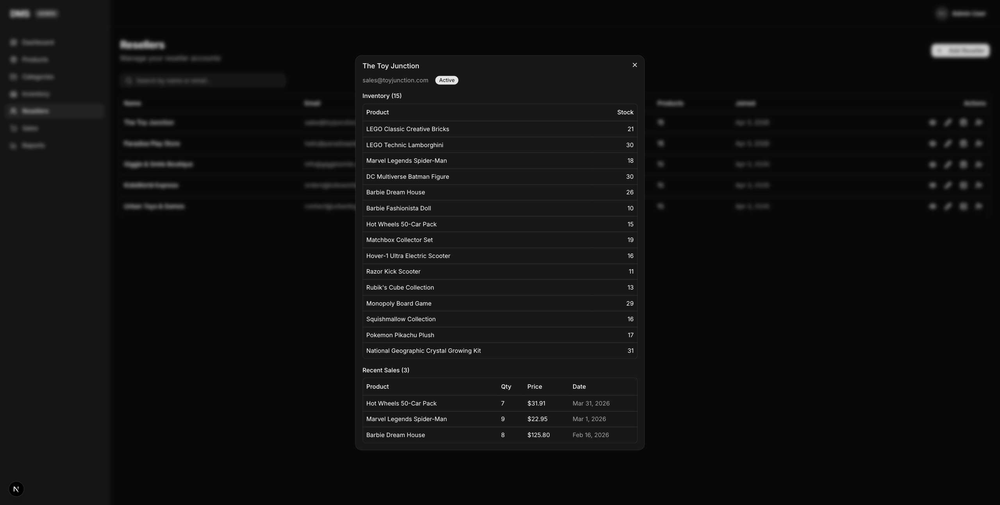
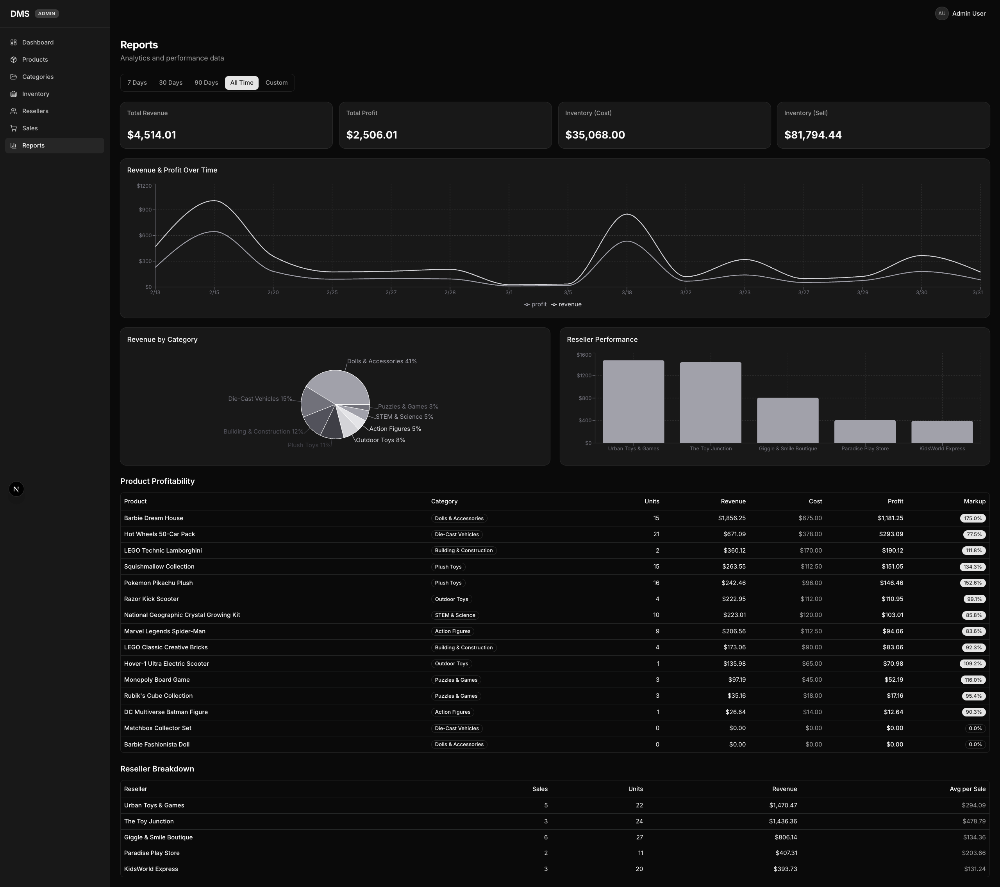

# DMS - Distribution Management System

A full-stack distribution and inventory management platform built for wholesale and reseller operations. Track products, manage inventory across multiple resellers, process sales, and analyze business performance from a single dashboard.

Built with **Next.js 16**, **Prisma**, **PostgreSQL**, and **Tailwind CSS**.

---

## Screenshots

### Admin Dashboard

Real-time overview of revenue, profit margins, inventory levels, and reseller activity. Includes low-stock alerts, top products by revenue, top-performing resellers, and recent sales and stock movement feeds.



---

### Products

Manage your full product catalog with cost/sell pricing, markup percentages, bulk price tiers, and category organization. Switch between **table view** for quick data scanning and **grid view** for a visual product showcase with category grouping.

| Table View | Grid View |
|:---:|:---:|
|  |  |

---

### Inventory

Full visibility into stock levels across all resellers. Summary cards show total units per reseller, with a searchable table tracking every product assignment, quantity, and last update.



---

### Sales

Complete sales management with pending approval queue and approved sales history. Per-reseller revenue cards, filterable sales table, and inline notes for wholesale orders.



---

### Resellers

Manage reseller accounts with quick-access inventory and recent sales views per reseller. Click any reseller to see their product stock levels and latest transactions.



---

### Reports & Analytics

Comprehensive analytics with revenue and profit trends over time, category revenue breakdown, reseller performance comparisons, and per-product profitability with markup percentages. Filter by 7 days, 30 days, 90 days, all time, or custom date ranges.



---

## Features

**Product Management**
- Full product catalog with categories, descriptions, and thumbnails
- Cost and sell price tracking with automatic markup calculation
- Bulk price tiers (quantity-based discounts)
- Table and grid view modes

**Inventory Control**
- Per-reseller inventory tracking
- Stock movement history (IN / OUT / ADJUSTMENT)
- Low-stock alerts on the dashboard
- Bulk stock operations

**Sales Processing**
- Sale recording with reseller attribution
- Approval workflow (Pending / Approved)
- Revenue and profit tracking per sale
- Historical sales feed

**Reseller Management**
- Reseller account creation and management
- Admin impersonation (view as reseller)
- Per-reseller inventory and sales dashboards
- Performance metrics and comparisons

**Reporting & Analytics**
- Revenue and profit trends over time
- Revenue breakdown by category
- Reseller performance comparison
- Product profitability rankings
- Configurable date ranges

**Authentication & Authorization**
- Role-based access control (Admin / Reseller)
- JWT-based session management
- Admin impersonation with secure cookie-based identity switching

---

## Tech Stack

| Layer | Technology |
|-------|-----------|
| Framework | Next.js 16 (App Router) |
| Language | TypeScript |
| Database | PostgreSQL (Neon) |
| ORM | Prisma 7 |
| Auth | NextAuth v5 (Credentials + JWT) |
| Styling | Tailwind CSS 4 |
| UI Components | shadcn/ui |
| Charts | Recharts |
| Image Storage | Vercel Blob |

---

## Getting Started

### Prerequisites

- Node.js 20+
- PostgreSQL database (or [Neon](https://neon.tech) serverless PostgreSQL)

### Installation

```bash
# Install dependencies
npm install

# Set up environment variables
cp .env.example .env
# Edit .env with your DATABASE_URL and secrets

# Generate Prisma client
npx prisma generate

# Run database migrations
npx prisma migrate dev

# Seed the database
npx prisma db seed

# Start development server
npm run dev
```

### Environment Variables

```env
DATABASE_URL="postgresql://..."
AUTH_SECRET="your-auth-secret"
BLOB_READ_WRITE_TOKEN="your-vercel-blob-token"
```

---

## Project Structure

```
src/
  app/
    (auth)/login/          # Login page
    admin/                 # Admin portal
      dashboard/           # Admin dashboard
      resellers/           # Reseller management
    reseller/              # Reseller portal
      dashboard/           # Reseller dashboard
      sales/               # Sales history
    api/                   # API routes
      auth/                # Auth endpoints
      resellers/           # Reseller CRUD
      admin/               # Admin endpoints
  components/
    layout/                # Header, sidebar, navigation
    ui/                    # Reusable UI components
  lib/
    auth.ts                # NextAuth configuration
    db.ts                  # Prisma client
    services/              # Business logic layer
  generated/prisma/        # Generated Prisma client
prisma/
  schema.prisma            # Database schema
  seed.ts                  # Database seeder
```

---

## Database Schema

```
User           Product         Sale             StockMovement
- id           - id            - id             - id
- email        - name          - resellerId     - productId
- password     - categoryId    - productId      - quantity
- name         - costPrice     - quantity       - type (IN/OUT/ADJ)
- role         - sellPrice     - soldPrice      - note
- active       - description   - status         - performedById
               - thumbnail     - notes          - userId
               - priceTiers[]  - createdAt      - createdAt

Category       PriceTier       Inventory
- id           - id            - id
- name         - productId     - userId
- products[]   - qty           - productId
               - costPrice     - quantity
               - sellPrice     - updatedAt
```

---

## License

Private project. All rights reserved.
